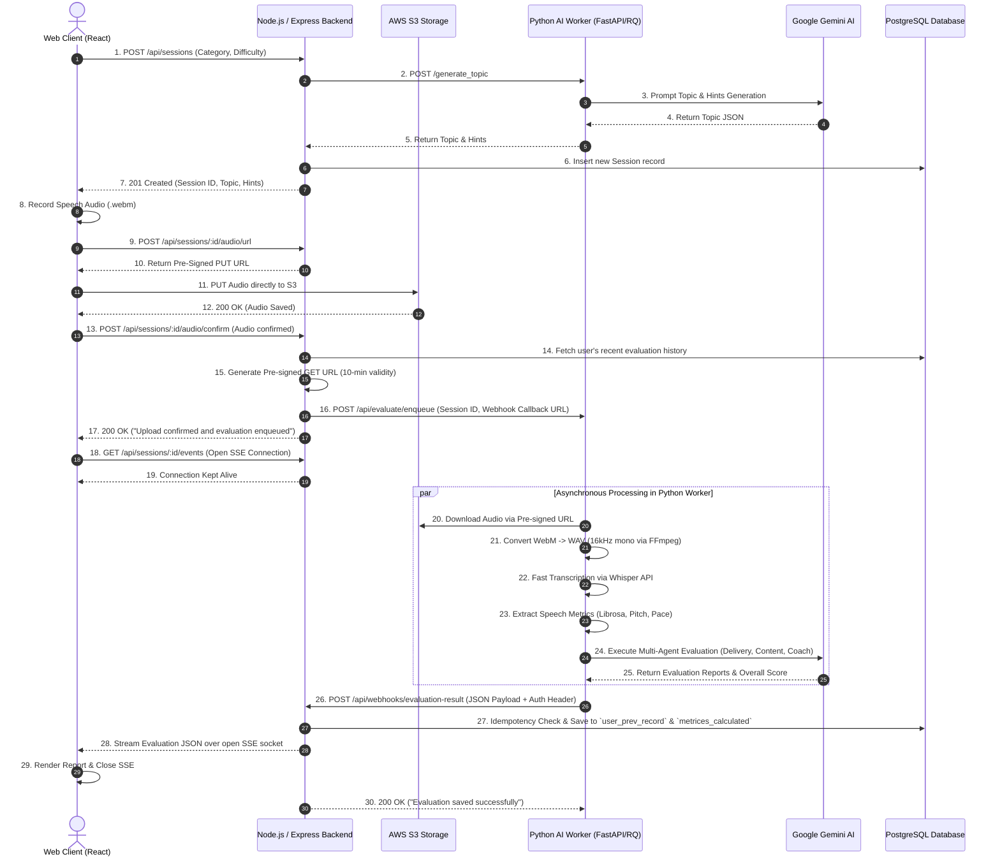

# Impromptu-AI: Architecture & System Mechanics

## 1. Executive Summary

**Impromptu-AI** is a polyglot microservices platform designed for real-time speech evaluation, acoustics analysis, and AI coaching. The system cleanly separates high-concurrency web API operations (**Node.js / Express**) from compute-intensive speech processing and LLM reasoning (**Python / FastAPI & Gemini**).

This document outlines the **Architecture Workflow**, highlighting critical design decisions—specifically addressing database decoupling, secure media handling, multi-agent evaluation pipelines, real-time Server-Sent Events (SSE), and the robust Services-Controller layered architecture in JavaScript.

---

## 2. End-to-End System Workflow (Sequence Diagram)

---

## 3. Deep-Dive Component Breakdown

### 3.1 Web API & Gateway Layer (Node.js / Express)
The backend enforces a strict **Controller-Service Architecture** entirely written in JavaScript (migrated from TypeScript for reduced build complexity while maintaining structural integrity).
* **Controllers (`src/controllers/`)**: Responsible solely for HTTP transport. They parse `req.body` using Zod schemas, invoke the appropriate Service, and format the `res.status().json()` response. Handled robustly by a global `catchAsync` wrapper.
* **Services (`src/services/`)**: Encapsulate all business logic. This separation allows controllers to remain thin and enables logic reusability. Examples include `session.service.js`, `auth.service.js`, and `audio.service.js`.
* **Real-time Engine (`sse.service.js`)**: Manages in-memory maps of open `text/event-stream` connections, mapped by `sessionId`. Eliminates database polling by streaming JSON down to the frontend exactly when the AI webhook fires.
* **Database Custodian**: Maintains exclusive read/write access to PostgreSQL via **Drizzle ORM** using tagged template literals (`sql`).
* **Global Error Handling**: All unhandled exceptions automatically bubble up to `errorHandler.js` where they are scrubbed, formatted as JSON, and logged to OpenTelemetry.

### 3.2 AI & Speech Analysis Service (Python / FastAPI)
* **Job Enqueue & Worker Pipeline (`worker.py`)**:
  1. **Audio Download**: Fetches `.webm` file from S3 pre-signed URL.
  2. **FFmpeg Transcoding**: Converts `.webm` to 16kHz mono `.wav`.
  3. **Acoustic Feature Extraction (`speech_analysis/`)**:
     * `pitch.py`, `energy.py`: Pitch variation & loudness consistency.
     * `speech_rate.py`, `pauses.py`, `fillers.py`: Articulation speed and filler counts.
  4. **Multi-Agent Evaluation Engine (`agents/`)**:
     * Evaluates acoustic features, transcript structure, and generates actionable coaching tips via LLMs.
  5. **Webhook Notification**: Posts finalized JSON payload back to the Node Express backend (`/api/webhooks/evaluation-result`).

### 3.3 Observability & Telemetry
* **Centralized Logging**: Node.js and Python push structured JSON logs to an **OpenTelemetry Collector**.
* **Log Aggregation**: OTel forwards logs to **Loki**, visualized via **Grafana** for real-time querying, debugging webhook failures, tracking SSE connections, and monitoring API latencies.

---

## 4. Comprehensive API Route Documentation

All requests (unless specified) require a valid JWT passed via Cookies or Authorization header.

### Auth Routes (`/api/auth`)
- **POST `/signup`**: Registers a new user, hashes password via bcrypt, returns user + JWT cookie.
- **POST `/login`**: Authenticates user, issues JWT cookie.
- **POST `/logout`**: Clears the JWT cookie.
- **GET `/me`**: Validates current JWT and returns user object.
- **GET `/google`**: Redirects to Google OAuth 2.0 consent screen.
- **GET `/google/callback`**: Handles Google OAuth response, upserts user, issues JWT cookie.

### User Routes (`/api/users`)
- **GET `/:userId/dashboard`**: Returns aggregated stats (total sessions, avg score, recent history) for the user dashboard.
- **GET `/:userId/history`**: Returns the complete chronological evaluation history for the user.
- **GET `/:userId/sessions/recent`**: Fetches recent historical data. *Accessible via standard Auth OR Internal Service Key (for AI Worker context).*
- **PUT `/:userId/profile`**: Updates user metadata (name, bio).
- **DELETE `/:userId`**: Performs a soft or hard delete of the user account and purges S3 assets.

### Session Routes (`/api/sessions`)
- **POST `/`**: Creates a new session. Expected body: `{ category, difficulty }`. Calls Python `/generate_topic` and inserts into DB.
- **GET `/:id`**: Fetches metadata for a specific session ID.
- **POST `/:id/audio/url`**: Generates and returns an AWS S3 Pre-signed URL for direct browser uploads.
- **POST `/:id/audio/confirm`**: Confirms successful S3 upload, fetches user history, and enqueues the job to the Python worker via HTTP POST.
- **GET `/:id/evaluation`**: *(Legacy/Fallback)* Checks the database for completion status (`processing` or `completed`).
- **GET `/:id/events`**: Initializes a long-lived **Server-Sent Events (SSE)** connection. Streams the evaluation JSON upon completion.

### Webhook Routes (`/api/webhooks`)
- **POST `/evaluation-result`**: Protected by `X-Internal-Service-Key`. The Python worker hits this endpoint to push the final AI analysis. Performs idempotency checks, saves to Postgres, and triggers the `sse.service` to push the payload to the frontend.

### Admin Routes (`/api/admin`)
*(Protected by `adminAuth` middleware asserting `role === 'admin'`)*
- **GET `/dashboard`**: Aggregates platform-wide metrics (total users, daily sessions, average scores).
- **GET `/users`**: Lists all registered users with pagination.
- **GET `/users/:id`**: Deep dive into a specific user's metrics.
- **GET `/sessions`**: Lists all platform sessions.
- **GET `/sessions/:id`**: Detailed view of a specific evaluation payload and raw acoustics data.

---

## 5. Architectural Decisions & Rationale

1. **Why Node.js & JavaScript for the Gateway?** 
   Express is uniquely tailored for I/O bound tasks, making it ideal for managing thousands of concurrent JWT validations, pre-signed URL generations, and active SSE sockets. Migrating to pure JS (from TS) eliminated build-step overheads and streamlined the CI/CD pipeline while maintaining structural safety via Zod validation.
2. **Why Python for AI/Acoustics?** 
   Python has a monopoly on robust scientific computing (Librosa) and AI ecosystem integrations (OpenAI/Gemini/Whisper). Isolating this logic keeps the Express event loop completely free of CPU-blocking audio transformations.
3. **Why Server-Sent Events (SSE) over Polling/WebSockets?**
   Previously, the frontend polled the database every 3 seconds. By switching to SSE, we eliminated redundant database queries. Unlike WebSockets, SSE operates over standard HTTP (port 80/443), requires no complex handshake, and perfectly fits our requirement for a one-way (Server -> Client) push notification.
4. **Why direct S3 uploads?**
   Audio files bypass the Node server entirely using pre-signed URLs, preventing the Node instance from running out of memory or bandwidth when handling large or concurrent file uploads.
