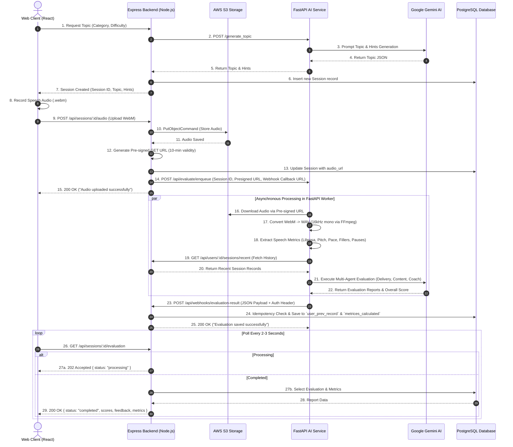

# Impromptu-AI: Updated Architecture Workflow & Mechanics

## 1. Executive Summary

**Impromptu-AI** (formerly Mypromptu) is a polyglot microservices platform designed for real-time speech evaluation, acoustics analysis, and AI coaching. The system cleanly separates high-concurrency web API operations (**Node.js / Express**) from compute-intensive speech processing and LLM reasoning (**Python / FastAPI & Gemini**).

This document outlines the **Updated Architecture Workflow**, highlighting critical design improvements over earlier architectural diagrams—specifically addressing database decoupling, secure media handling, multi-agent evaluation pipelines, and asynchronous webhook persistence.

---

## 2. Architectural Evolution & Flaw Resolution

The updated architecture resolves key structural flaws found in earlier system flow designs:

| Architectural Component | Previous Flow (Flawed / Theoretical) | Updated Flow (Current Implementation) | Why the Change Was Made |
| :--- | :--- | :--- | :--- |
| **Database Ownership** | FastAPI AI worker directly queried & inserted into PostgreSQL. | **Express Backend is the sole DB custodian.** FastAPI returns results to Express via a Webhook (`POST /api/webhooks/evaluation-result`). | Eliminates multi-service DB coupling, prevents schema migration sync issues, and maintains a Single Source of Truth. |
| **Audio Access Security** | Direct file pass-through or shared filesystem access between services. | **AWS S3 Pre-Signed GET URLs** (10–15 min expiry) generated by Express for FastAPI. | Avoids sharing AWS credentials with worker processes, eliminates OOM risks, and keeps services stateless. |
| **Context Fetching** | AI Worker executed direct SQL queries against Postgres for user history. | FastAPI fetches history via **Express Internal REST API** (`GET /api/users/:id/sessions/recent`) using `X-Internal-Service-Key`. | Enforces microservice boundaries and API-first communication. |
| **AI Evaluation Engine** | Generic single-step LLM call / monolithic processing. | **Multi-Agent Evaluation Pipeline** (`DeliveryAgent`, `ContentAgent`, `OverallCoach`) combined with Librosa acoustic feature extraction. | Provides specialized, domain-focused feedback (acoustics vs. content composition vs. overall speech score). |
| **Response Delivery** | Synchronous or assumed direct response from FastAPI back through Express to user. | **Asynchronous Task Queue & Frontend Polling** (`GET /api/sessions/:id/evaluation`). | Prevents HTTP timeouts on long AI evaluations (15–45s) and keeps UI responsive. |

---

## 3. End-to-End System Workflow (Sequence Diagram)

---

## 4. Deep-Dive Component Breakdown

### 4.1 Frontend Layer (React / Vite Dashboard)
* **Audio Recording**: Captures live microphone stream into MediaRecorder API, encoding as `.webm` audio containers.
* **Non-blocking Polling**: Upon uploading audio, enters a polling state querying `GET /api/sessions/:id/evaluation`.
* **Visualization Engine**: Displays radar charts for delivery metrics, filler word counts, pitch/energy graphs, and AI coaching summaries once status shifts to `completed`.

### 4.2 Web API & Gateway Layer (Node.js / Express)
* **JWT Auth & Authorization**: Validates incoming user JWT tokens and verifies session ownership.
* **Database Custodian**: Maintains exclusive read/write access to PostgreSQL via **Drizzle ORM**.
* **Pre-Signed URL Generator**: Leverages `@aws-sdk/s3-request-presigner` to create short-lived pre-signed download links for the AI service.
* **Webhook Ingestion Endpoint (`/api/webhooks/evaluation-result`)**:
  * Authenticates calls using `X-Internal-Service-Key`.
  * Enforces idempotency to prevent duplicate writes on webhook retries.
  * Writes to `user_prev_record` (qualitative feedback & scores) and `metrices_calculated` (acoustic metrics JSON).

### 4.3 AI & Speech Analysis Service (Python / FastAPI)
* **Topic Generation (`/generate_topic`)**: Synchronous Gemini prompt execution returning structured topics and 5 speech hints.
* **Job Enqueue & Worker Pipeline (`worker.py`)**:
  1. **Audio Download**: Fetches `.webm` file from S3 pre-signed URL.
  2. **FFmpeg Transcoding**: Converts `.webm` to 16kHz mono `.wav` format required for signal analysis.
  3. **Acoustic Feature Extraction (`speech_analysis/`)**:
     * `pitch.py`: Pitch variation & fundamental frequency calculation.
     * `energy.py`: Volume dynamics and loudness consistency.
     * `speech_rate.py` & `pauses.py`: Articulation speed, silence ratio, and pause duration.
     * `fillers.py` & `repetitions.py`: Detects vocalized stutters and filler words.
  4. **Context Fetching**: Calls Express REST API (`/api/users/:userId/sessions/recent`) for baseline benchmarking.
  5. **Multi-Agent Evaluation Engine (`agents/`)**:
     * `DeliveryAgent`: Evaluates acoustic features (pace, pauses, clarity).
     * `ContentAgent`: Analyzes transcript structure, relevance to topic, and vocabulary.
     * `OverallCoach`: Synthesizes delivery and content insights into an overall score, strengths, weaknesses, and actionable tips.
  6. **Webhook Notification**: Posts finalized JSON payload to Express backend.

### 4.4 Data Model & Storage Layer
* **AWS S3**: Secure object store for raw user audio (`audio/{userId}/{sessionId}-{timestamp}.webm`).
* **PostgreSQL Database**:
  * `sessions`: Session metadata, category, difficulty, topic, hints, audio URL.
  * `user_prev_record`: Session evaluations (summary, strengths, weaknesses, improvement tips, overall score).
  * `metrices_calculated`: Detailed mathematical acoustic metrics JSON.

---

## 5. Architectural Benefits Summary

1. **Clean Microservice Decoupling**: Express manages HTTP routing, Auth, and DB state; FastAPI manages CPU-heavy math and LLM orchestration.
2. **Stateless Operations**: AI workers require no database credentials, local persistent disks, or long-term cloud storage keys.
3. **High System Resilience**: Slow LLM responses or speech processing spikes do not block the Express event loop or affect user navigation.
4. **Data Security & Privacy**: Audio files are accessed via temporary pre-signed links that automatically expire.
